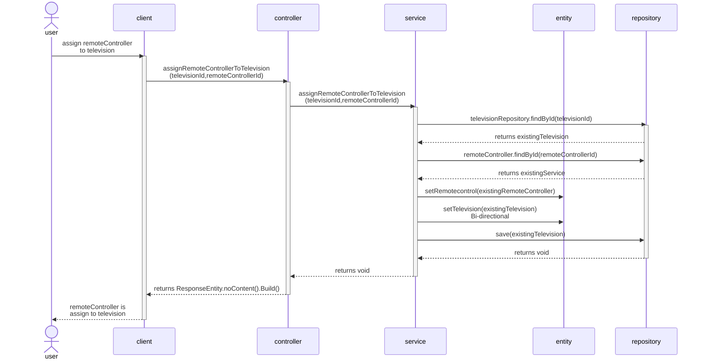

```mermaid 
sequenceDiagram
%%    participant user
    actor user
    participant client
    participant controller
    participant service
    participant entity
    participant repository
    
    user->>client: assign remoteController<br/> to television
    activate client
    client->>controller: assignRemoteControllerToTelevision<br/>(televisionId,remoteControllerId)
    activate controller
    controller->>service: assignRemoteControllerToTelevision<br/>(televisionId,remoteControllerId)
    activate service
    service->>repository: televisionRepository.findById(televisionId)
    activate repository
    repository-->>service: returns existingTelevision
    service->>repository: remoteController.findById(remoteControllerId)
    repository-->>service: returns existingService
    service->>entity: setRemotecontrol(existingRemoteController)
    service->>entity: setTelevision(existingTelevision)<br/>Bi-directional
    service->>repository: save(existingTelevision)
    repository-->>service: returns void
    deactivate repository
    service-->>controller: returns void
    deactivate service
    controller-->>client: returns ResponseEntity.noContent().Build()
    deactivate controller
    client-->>user: remoteController is<br/> assign to television
    deactivate client
    
```